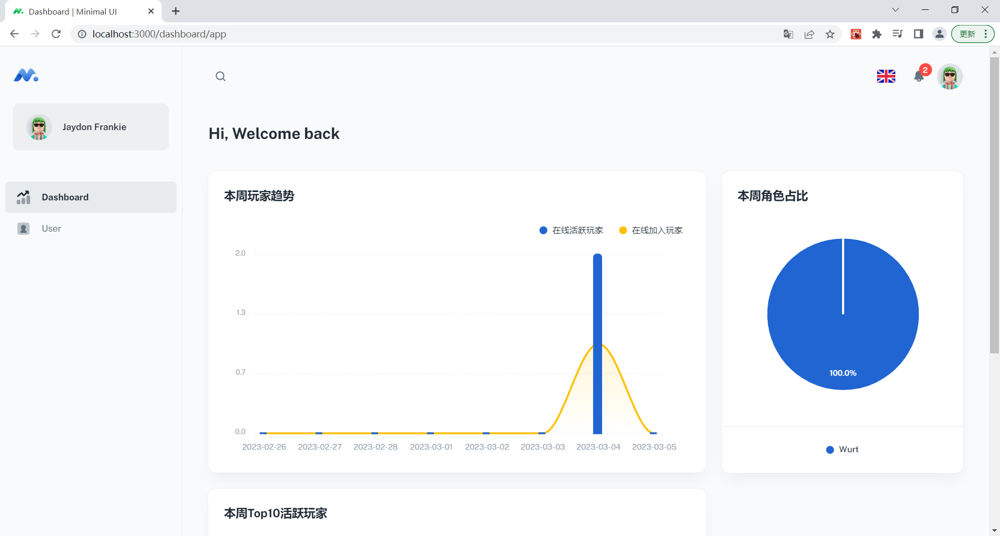
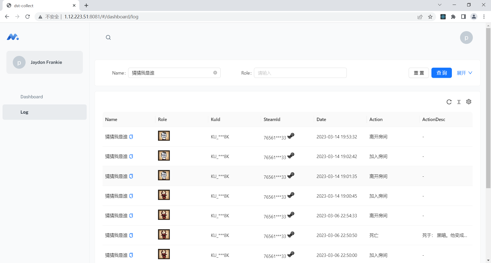

# 饥荒联机版玩家日志采集

## 使用

修改`config.yml`文件
```yaml
#启动的端口
port: 8081
# 饥荒存档的位置 例子： C:\Users\xxx\Documents\Klei\DoNotStarveTogether\xxx\Cluster_2
path: xxxxxx
# 数据存放的文件
db: dst-collect.db
```

### windows
执行运行 dst-collect.exe

### linux
./dst-collect 或者运行 ./run.sh

## 展示

